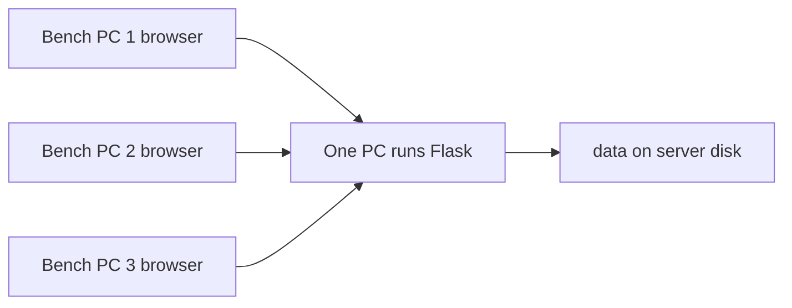

# Multi-computer deployment

How to run BOM Builder across several PCs in a work area. The app is a **single-user local Flask app** with no login and **no concurrent-write protection**. All state lives in JSON under `data/`:

| File | Contents |
|------|----------|
| `data/needs/{bom_id}.json` | BOM lines, acquired checkmarks, notes, board count |
| `data/inventory.json` | Stock on hand |
| `data/compare_category_overrides.json` | Manual category moves (Compare + Inventory) |

Paths are set in `bom_builder/storage.py` relative to the project folder. By default the app binds to **127.0.0.1:5000** in `main.py` — only the machine running Python can open the UI.

`data/` is tracked in Git for backup and async sync. That works well for infrequent updates; it is a poor fit when two people edit `inventory.json` at the same time (merge conflicts).

---

## Recommended: one LAN server PC

Use this when you want **one shared inventory** that everyone sees immediately.



### Setup (no code changes)

1. **Pick a host PC** — on when the lab is active; reliable LAN. Install Python 3.11+, clone the repo, create venv, `pip install -r requirements.txt`, and [Tesseract](https://github.com/UB-Mannheim/tesseract/wiki) if using label scan.

2. **Run on the LAN** (not localhost only):

   ```bash
   # Windows
   .venv\Scripts\python main.py --host 0.0.0.0 --port 5000 --no-browser

   # macOS / Linux
   .venv/bin/python main.py --host 0.0.0.0 --port 5000 --no-browser
   ```

3. Find the server IP (`ipconfig` on Windows → IPv4, e.g. `192.168.1.42`).

4. **Other PCs** open `http://192.168.1.42:5000/` and bookmark it.

5. **Windows Firewall** on the server: allow inbound TCP **5000** (Private network only).

6. **Lab rules** (until auth exists):
   - Only **one person edits inventory at a time**, or coordinate verbally.
   - BOM uploads and board counts live on the server — no per-PC copies.
   - Label scan: Tesseract must be on the **server** (browsers only upload the photo).

7. **Backups**: from the server, periodically:

   ```bash
   git add data/
   git commit -m "Update BOM and inventory data"
   git push
   ```

### Optional hardening (future code changes)

| Change | Why |
|--------|-----|
| `BOM_DATA_DIR` env var | Point data at `\\NAS\Lab\BOM_Builder\data` |
| `debug=False` on LAN | Safer on a network |
| File lock or overwrite warning | Safer concurrent inventory edits |
| README LAN section | Onboarding (this doc) |

---

## Alternative A: Git sync per PC

Best when **one person per machine** and updates are **infrequent**.

1. Clone the repo on each PC (see README Quick start).
2. **Before** work: `git pull`
3. Run locally: `http://127.0.0.1:5000/`
4. **After** work: `git add data/`, commit, `git push`
5. Other PCs `git pull` before their session.

**Risks:** merge conflicts on `inventory.json`; stale data if someone forgets pull/push. Use as backup, not primary, if several people touch stock daily.

---

## Alternative B: shared network folder for `data/`

If you have `\\server\share` or a NAS:

- Clone the app on each PC (code only).
- Put `data/` on the share, e.g. `\\LabShare\BOM_Builder\data\`
- Requires making `DATA_DIR` configurable (today: `PROJECT_ROOT / "data"`).

**Risks:** two Flask instances writing the same JSON can corrupt files; SMB latency on autosave. Prefer **one Flask instance** (LAN server model).

---

## Setup checklist

| Item | Server PC | Client PCs (browser) | Git-only PCs |
|------|-----------|----------------------|--------------|
| Python 3.11+ venv | Yes | No | Yes |
| `pip install -r requirements.txt` | Yes | No | Yes |
| Tesseract (label scan) | Yes | No | Yes if scanning locally |
| Clone from GitHub | Yes | No | Yes |
| Run `main.py` | Yes (`0.0.0.0`) | No | Yes (`127.0.0.1`) |
| Browser URL | localhost or LAN IP | `http://SERVER_IP:5000` | localhost |

---

## Operating rules

1. Designate who owns **inventory** edits vs BOM checklist viewing.
2. Keep BOM **filenames consistent** so `bom_id` matches across uploads.
3. Use **Compare → Combined totals** when checking multiple boards against one stock list.
4. Weekly Git push of `data/` from the canonical host; export CSV before large imports.

---

## Decision guide

| Situation | Approach |
|-----------|----------|
| Same WiFi, one live stock list | **LAN server** (recommended) |
| NAS, no dedicated server PC | LAN server on NAS host, or shared `data/` + env var |
| Each person works alone, sync end of day | **Git pull/push** |
| Mixed | LAN server for data + Git for app updates |

---

## Rollout phases

**Phase 1 — No development**  
LAN server, firewall, bookmarks on bench PCs.

**Phase 2 — Documentation and safety**  
This guide, disable debug on LAN, optional `BOM_DATA_DIR`.

**Phase 3 — Only if needed**  
Inventory conflict handling; simple auth on untrusted networks.

You do **not** need cloud hosting, Docker, or a database for a small lab.
