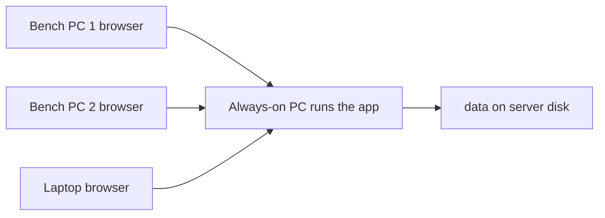

# Multi-computer deployment

How to use BOM Builder from several computers in a work area. The app is a
**Flask web app** with no login. All state lives in JSON under `data/`:

| File | Contents |
|------|----------|
| `data/needs/{bom_id}.json` | BOM lines, acquired checkmarks, notes, board count |
| `data/inventory.json` | Stock on hand |
| `data/shopping_list.json` | Shopping list state (buy qty, ordered, alternates) |
| `data/compare_category_overrides.json` | Manual category moves (Compare + Inventory + Shop) |

The recommended setup is **one always-on PC that runs the app**; every other
computer just opens it in a browser. No Python, no install, and no per-PC copy of
the data — everyone sees the same live inventory.

---

## Recommended: one always-on LAN server



Pick one PC that stays on whenever the lab is active and has a reliable network
connection. It runs the app; everyone else points a browser at it.

### 1. Set up the host PC (one time)

1. Install **Python 3.11+**.
2. Clone the repo and create the virtual environment:
   ```powershell
   git clone <repo-url> BOM_Builder
   cd BOM_Builder
   python -m venv .venv
   .\.venv\Scripts\pip install -r requirements.txt
   ```
3. If you use label scanning, install
   [Tesseract](https://github.com/UB-Mannheim/tesseract/wiki) on the host (clients
   only upload the photo; OCR runs on the server).

### 2. Run it on the network

Use the bundled launcher (binds to all interfaces, uses **waitress**, debug **off**):

```powershell
.\run_server.ps1
```

Equivalent manual command:

```powershell
.\.venv\Scripts\python main.py --host 0.0.0.0 --port 5000 --no-browser
```

Notes on the flags (see `main.py`):
- `--host 0.0.0.0` makes the app reachable from other PCs (default is localhost-only).
- With `--host 0.0.0.0` and `--server auto` (the default), the app runs on **waitress**,
  a small production-grade server, when it is installed.
- **Debug is OFF by default.** Never pass `--debug` on a network-reachable host — Flask's
  debugger allows remote code execution. The app prints a warning if you do.

### 3. Find the host IP

```powershell
ipconfig
```
Note the IPv4 address, e.g. `192.168.1.42`.

### 4. Open it from the other computers

In any browser on the same network, go to `http://192.168.1.42:5000/` and bookmark
it. Nothing to install on these machines.

### 5. Allow the port through Windows Firewall (host)

Allow inbound **TCP 5000**, Private network only:

```powershell
New-NetFirewallRule -DisplayName "BOM Builder" -Direction Inbound -Protocol TCP `
  -LocalPort 5000 -Action Allow -Profile Private
```

### 6. Backups (from the host)

`data/` is tracked in Git. Periodically commit and push from the host:

```powershell
git add data/
git commit -m "Update BOM and inventory data"
git push
```

---

## Auto-start on the always-on PC

So the server comes back after a reboot without anyone launching it.

### Option A — Task Scheduler at log on (recommended)

Simplest reliable option. Starts the server when the host account logs in.

1. Open **Task Scheduler** → **Create Task** (not "Basic").
2. **General:** name it `BOM Builder`. Check **Run whether user is logged on or not**.
3. **Triggers:** New → **At log on** (or **At startup** if the account auto-logs-in).
4. **Actions:** New → **Start a program**:
   - Program/script: `powershell.exe`
   - Arguments: `-ExecutionPolicy Bypass -File "C:\Users\Brian\PycharmProjects\BOM_Builder\run_server.ps1"`
   - Start in: `C:\Users\Brian\PycharmProjects\BOM_Builder`
5. **Settings:** uncheck "Stop the task if it runs longer than…" so it stays up.
6. Save (enter the account password if prompted).

### Option B — true Windows service with NSSM (starts at boot, no login)

Most robust; runs even when no one is logged in. Requires
[NSSM](https://nssm.cc/) (the Non-Sucking Service Manager).

```powershell
nssm install BOMBuilder "C:\Users\Brian\PycharmProjects\BOM_Builder\.venv\Scripts\python.exe" `
  "C:\Users\Brian\PycharmProjects\BOM_Builder\main.py --host 0.0.0.0 --port 5000 --no-browser"
nssm set BOMBuilder AppDirectory "C:\Users\Brian\PycharmProjects\BOM_Builder"
nssm start BOMBuilder
```
Manage with `nssm restart BOMBuilder` / `nssm stop BOMBuilder` /
`nssm remove BOMBuilder confirm`.

### Option C — manual

Double-click `run_server.ps1` (or run it in PowerShell) whenever you need the server.

### Non-Windows hosts

- **Linux:** a `systemd` unit running `.venv/bin/python main.py --host 0.0.0.0 --port 5000 --no-browser` with `Restart=always`.
- **macOS:** a `launchd` agent/daemon running the same command.

---

## Operating rules (no login yet)

1. **One person edits inventory at a time**, or coordinate verbally. The app saves the
   whole file on each change, so two people editing inventory simultaneously can
   overwrite each other's edits (see Concurrency below). Viewing from many PCs is fine.
2. Keep BOM **filenames consistent** so `bom_id` matches across uploads.
3. BOM uploads and board counts live on the server — no per-PC copies.
4. Use **Compare → Combined totals** when checking multiple boards against one stock list.
5. Export CSV before large imports.

---

## Concurrency: what's protected and what isn't

- **Protected:** writes are atomic (written to a temp file then renamed), so a crash or
  power loss mid-save cannot corrupt a JSON file, and a reader never sees a half-written
  file. Inventory also auto-backs-up if a save would wipe most rows.
- **Not protected:** because each save rewrites the *entire* file, if two browsers load
  the same page and both edit, the second save wins and the first person's change is
  silently lost — even when they edited different rows. This is why the operating rule
  above asks for one inventory editor at a time.

If routine simultaneous multi-person editing becomes the norm, the next step is either
per-field "patch under lock" saves or migrating `data/` to **SQLite** (which gives
proper row-level concurrency). Not needed for a small lab with one active editor.

---

## Optional: relocate the data directory

Set `BOM_DATA_DIR` to store `data/` somewhere other than the project folder (e.g. a
backed-up location or a share):

```powershell
$env:BOM_DATA_DIR = "D:\BOM_Builder_data"
.\run_server.ps1
```

Run **only one** app instance against a given data directory. Two Flask instances
writing the same JSON over SMB can still clobber each other — prefer the single
always-on server model above.

---

## Alternatives (secondary)

### Git sync per PC

Best when **one person per machine** and updates are **infrequent**.

1. Clone the repo on each PC.
2. **Before** work: `git pull`
3. Run locally: `python main.py` → `http://127.0.0.1:5000/`
4. **After** work: `git add data/`, commit, `git push`

**Risks:** merge conflicts on `inventory.json`; stale data if someone forgets to
pull/push. Use as backup, not primary, if several people touch stock daily.

### Shared network folder for `data/`

Point `BOM_DATA_DIR` at `\\server\share\BOM_Builder\data\` and run the app on each PC.
**Risk:** two instances writing the same JSON can corrupt/clobber files; SMB latency on
autosave. Prefer **one** instance (the LAN server model).

---

## Setup checklist

| Item | Server PC | Client PCs (browser) | Git-only PCs |
|------|-----------|----------------------|--------------|
| Python 3.11+ venv | Yes | No | Yes |
| `pip install -r requirements.txt` | Yes | No | Yes |
| Tesseract (label scan) | Yes | No | Yes if scanning locally |
| Clone from GitHub | Yes | No | Yes |
| Run `main.py` | Yes (`--host 0.0.0.0`) | No | Yes (`127.0.0.1`) |
| Browser URL | localhost or LAN IP | `http://SERVER_IP:5000` | localhost |

---

## Decision guide

| Situation | Approach |
|-----------|----------|
| One shared, live stock list across PCs | **Always-on LAN server** (recommended) |
| NAS, no dedicated server PC | LAN server on the NAS host, or one instance + `BOM_DATA_DIR` on the share |
| Each person works alone, sync end of day | **Git pull/push** |
| Frequent simultaneous multi-person editing | LAN server now; plan a SQLite migration |
